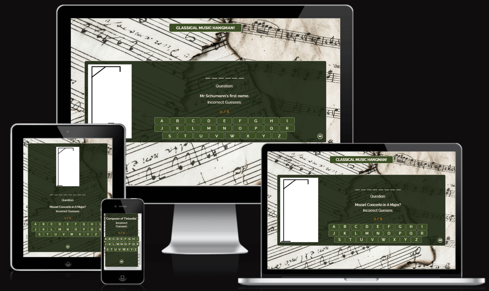

# Classical Music 'Hangman' Game

This project is designed to be an interactive and fun game, based on the traditional 'hangman' game but with the specific theme of classical music.

Find the link to the site [here](https://niallpcarroll.github.io/musical-hangman/)

## Contents

- [User Experience](#user-experience)
  - [User Stories](#user-stories)
- [Design](#design)
  - [Colour Scheme](#colour-scheme)
  - [Typography](#typography)
  - [Imagery](#imagery)
  - [Wireframes](#wireframes)
- [Features](#features)
  - [General Features on Each page](#general-features-on-each-page)
  - [Future Implementations](#future-implementations)
  - [Accessibility](#accessibility)
- [Technologies Used](#technologies-used)
  - [Languages Used](#languages-used)
  - [Frameworks, Libraries & Programs Used](#frameworks-libraries--programs-used)
- [Deployment & Local Development](#deployment--local-development)
  - [Deployment](#deployment)
  - [Local Development](#local-development)
    - [How to Fork](#how-to-fork) 
    - [How to Clone](#how-to-clone)
- [Testing](#testing)
- [Credits](#credits)
  - [Content](#content-references)
  - [Media](#media)
  - [Acknowledgments](#acknowledgments)

## User Experience
Musical Hangman is intended to be an easy-to-use, simple and fun game. The design is uncluttered, displaying only what is necessary for the game, making its use self-explanatory. As it is entirely focused on the subject of music, there is a clear educational function to it as it could be used by children and older music students.

### User Stories
* The website should be very straightforward for the user - the objective of the game is self-explanatory: there is a keyboard display, indications as to the length of the answer, and a counter for wrong answers. The pop-up gives a clear option to re-start the game.

* The user wants a game which can be played more than once. The JavaScript code currently includes over forty questions and answers, which are chosen at random, so the game can be played multiple times.

## Design
### Colour Scheme
There are three dominant colours used throughout this website: #faf0e6, #3a4d23 and #1a230f. The first, #faf0e6 (or "Linen") is an off-white shade and it is used to emphasise borders as well as being the main text colour. #1a230f is a shade of dark green and it is used to provide a high contrast background for the off-white text. #3a4d23 is a lighter shade of green - it is used for the keyboard buttons, providing a contrast with the dark green background, while also contrasting with the #faf0e6 lettering. The colour scheme is inverted when the mouse is hovered over the keyboard buttons - the letters turn green while the background turns to linen.

I used [Contrast Grid](https://eightshapes.com) to check compliance of the main colours with WCAG 2.0 minimum contrast. The result is a rating of 14.4 for #faf0e6 and #1a230f, and a rating of 8.2 for #faf0e6 and #3a4d23. The contrast score between the two shades of green does not pass, but neither colour is used with the other in the context of text with background.

### Typography
The website uses one font throughout: "Raleway".

The "Raleway" font is a serif font which is very neat, light and easy to read, while not appearing overly formal in its style.

### Imagery
* The main imagery currently employed on the website is a series of seven simple images drawn by the author to depict the progression of the hangman image. Here is the final image which displays before the game ends if the player is unsuccessful:

* For visual appeal and contrast, particularly on large screens, there is a background featuring music manuscript paper and notation. The main colour behind the game itself (#1a230f), however, is only slightly opaque to allow this image to be barely visible while not distracting from the game itself or negatively affecting the contrast with the text colour. 

### Wireframes 
These were the original wireframe ideas for the game layout:

Images of wireframes for mobile devices:

***

Images of wireframes for large screens:

***

## Features
This website contains one main page:

### General Features on each page
**The keyboard**, is where the main user interaction takes place. It is a simple keyboard supplying only the twenty-six letters of the alphabet since other characters are unnecessary for this game. It is styled initially to display light-green buttons with a linen border, while the letters themselves are linen:

Screenshot of keyboard at the beginning of a game

On devices where the game is played with a mouse, the buttons will respond by changing colour when the mouse is hovered over them:

Screenshot of keyboard when mouse is hovered over key

When a keyboard button is clicked, the button becomes transparent, the border disappears, the letter turns dark-orange, and the button cannot be clicked again:

Screenshot of keyboard when button is clicked

**Letter Spaces** display above the question and tell the user how many letters the answer contains. When a correct letter is selected on the keyboard, it appears in the correct letter space (or spaces if the same letter occurs more than once) and the line denoting the space disappears:

Screenshot of correct letters placed in the answer section

**The counter** keeps track of incorrect letters chosen by the player. It is displayed in dark-orange directly above the keyboard. A player may have six incorrect guesses before the game ends:

Screenshot counter recording incorrect three incorrect guesses

**The hangman image** changes along with the counter according to how many incorrect guesses the player makes:

Screenshot of hangman image after three incorrect guesses
 

Screenshot of hangman image after four incorrect guesses

**The Modal** pop-up appears when the game ends. If the player successfully guesses the correct answer, the pop-up will display a medal image with a congratulatory message. On the other hand, if the player makes six incorrect choices, the hangman image will be complete, and the appearing pop-up will display a "game over" image and the correct answer.

Screenshot of pop-up after guessing the correct word

Screenshot of pop-up after choosing six incorrect letters

**The Play Again** button appears at the bottom of the modal. Clicking it will begin a new game by resetting the counter, keyboard, and hangman image, and selecting a new question.

Screenshot of "Play Again" button on modal

### The Error page
**The Error page** will appear if a page does not load or if the user attempts to access a non-existent page on the website. This page is styled in the same general way as the rest of the website, and the message which appears provides a link through which the user can return to the homepage to begin a new game.

Screenshot of Error 404 page

### Responsive Design
The game display is designed to be responsive throughout - the design changes to be more compatible depending on which screen size the visitor uses. On mobile devices, content appears in a single column, while the game title disappears to allow more space for the game itself. On larger devices the content of the home page spreads out to take up more of the available space, with the hangman image appearing on the left and the keyboard, questions and letter spaces appearing on the right.

### Future Implementations
There is plenty of potential for future development of this game. Some features that are planned but not yet executed are:
- It will be very easy to add questions to the current list in JavaScript. 
- The possibility of adding difficulty levels, such as 'easy', 'medium', and 'difficult' to appeal to players of different ages and experience.
- The possibility of adding audio and visual clues instead of text questions alone.

### Accessibility
The website is designed to be accessible. Measures taken to ensure this include:
- Design which aims to minimise clutter, avoiding overload of images and text.
- High colour contrast between background and text.
- Clearly defined text areas.
- Alt attributes on all images.

## Technologies Used

### Languages Used
This website has been created using HTML and CSS and JavaScript.

### Frameworks, Libraries & Programs Used
+ [Google Fonts](https://fonts.google.com) -  For Raleway font.

+ Git - For version control.

+ Github - To save & store files and deployment.

+ Gitpod - IDE used to write the code.

+ [Balsamiq](https://www.balsamiq.com) - For wireframes.

## Deployment & Local Development

### Deployment
Github pages is used to deploy this site. To deploy the site yourself, follow these instructions:

1. Sign in to Github.
2. Go to the repository for this project called [*musical-hangman*](https://github.com/niallpcarroll/musical-hangman.git).
3. Click *settings*.
4. In the column to the left, click *pages*.
5. From the dropdown, select *main branch* and then save.
6. The site is now deployed.
### Local Development

#### How to Fork
To fork the repository:

1. Log in to Github.

2. Go to the repository for this project called [*musical-hangman*](https://github.com/niallpcarroll/musical-hangman.git).

3. Click the Fork button in the top right corner.
#### How to Clone
1. Log in (or sign up) to GitHub.

2. Go to the repository for this project, [*musical-hangman*](https://github.com/niallpcarroll/musical-hangman.git).

3. Click *Code* and choose whether you would like to clone with HTTPS, SSH or GitHub CLI and copy the link.

4. Open the terminal in your code editor and change the current working directory to the location you want to use for the cloned directory.

5. Type the following command in the terminal (after the git clone you will need to paste the link you copied in step 2 above):

      git clone { & THE LINK FROM STEP 2 }

## Testing
### Validator Testing
I have used W3C validator to validate my HTML code and CSS code. I validated them via direct input.
CSS and HTML for all pages passed without errors.

#### HTML Validation

Index/Landing page HTML validation
 

Gallery page HTML validation

Contact page HTML validation

#### CSS Validation

Walking Galway History CSS validation

#### Lighthouse
Lighthouse is a tool created by Google to test a website's performance, accessibility, best practices, SEO and qualification as a progressive web application.

It gives scores on the usability of the website. Tests were carried out for the Home, Gallery and Contact pages for the mobile version and the desktop version. Overall the scores for desktop devices are good, but performance is weaker for mobile devices, most likely due to some images being larger than necessary.

**The scores for a desktop device:**

Lighthouse score for Home page

Lighthouse score for Gallery page

Lighthouse score for Contact page

**The scores for a mobile device:**

Lighthouse score for Home page

Lighthouse score for Gallery page

Lighthouse score for Contact page

#### WAVE
WAVE provides evaluation tools which help authors and web designers make their web content more accessible to people with disabilities. This is the result of testing with WAVE:

An error appeared after the first test, indicating that a label element was missing text content. This error was corrected by adding an aria label and description to the label element in the navbar section.

### Manual Testing
#### Features
Below is a table with the website's features, detailing how it has been tested and the outcomes of testing:

|Feature|Test case|Outcome|
|---|---|---|
|Open Page| - |Image visible, keyboard & question appear |
|Keyboard |Click letter |Letter fades, turns orange, no re-selection |
|Keyboard (large screen) |Hover |Button colours inverted |
|Keyboard |Click correct letter |Letter appears above question |
|Keyboard |Click incorrect letter |Letter does not show above question |
|Keyboard |Click incorrect letter |Hangman image changes, incorrect counter increases by 1 |
|Keyboard |Click 6 incorrect letters |Pop-up message appears with image, correct answer & replay button |
|Keyboard |Correct answer input |Pop-up message appears with image, correct answer & replay button |
|Replay button |Click |New game begins |
|Error page |Attempt navigation to non-existent page |Error page and message displays |
|Error page |Click on link to return to game |Returns user to game |

#### Screen size compability
Below is a table with different devices and the outcomes when visiting the website using different screen sizes.

|Device|Responsive <782px|Responsive 782px to 991px|Responsive 992px to 1919px|Responsive >=1920px| Renders as expected |
|---|---|---|---|---|---| 
|Galaxy S8+ |Yes |n/a |n/a |n/a |Yes |
|iPad Mini |n/a|Yes |n/a |n/a |Yes |
|Laptop (1366px wide) |n/a |n/a |Yes |n/a |Yes |
|Desktop (1920px wide) |n/a |n/a |n/a |Yes |Yes |

#### Browser compability
Below is a table with different browsers which records the result of appearance and responsiveness of the website: 

|Browser|Intended Appearance|Intended Responsiveness|
|---|---|---|
|Chrome |Yes |Yes |
|Firefox |Yes |Yes |
|Edge |Yes |Yes |
|Brave |Yes |Yes |

#### Bugs
A number of bugs were identified during the course of testing. These are outlined below:

| Bug | Section | Fix |
|---|---|---|
| getRandomWord function not working | index.html / script.js | Moved questions from words.js to script.js |
| Question & keyboard no appearing | index.html / script.js | Corrected spelling error in script.js |
| Hangman image not displaying | index.html / script.js | Replaced '' with `` |
| Modal pop-up preventing keyboard from functioning |index.html / script.js / style.css | Altered 'pointer events' to 'none' in css |
| Letter spaces not appearing after adding reset button | index.html / script.js | Corrected newWord variable |
| Error page message styling not appearing correctly | index.html / style.css | Styling incorrectly placed in media query section - moved to main css section  

## Credits

### **Content References**
+ This project is inspired by a tutorial from [CodingNepal](https://www.codingnepalweb.com/build-hangman-game-html-javascript/) . I acknowledge in particular assistance provided in it for the JavaScript code for the modal pop-up and the reset parameters for the game.

+ Content on JavaScript event listeners from the Love Maths project coursework.

+ [Code Institute](https://codeinstitute.net/ie/) for general JavaScript learning material.

+ Apart from references listed above, the code and content of the website is written by myself.

### Media

+ [Icons 8](https://icons8.com) for the Favicon image.

+ The background image of music manuscript, both of the modal images, and the error page image, were freely available from [Pexels](https://www.pexels.com) .

+ The hangman images are my own using screenshots from Microsoft Paint app.

### Acknowledgments
I wish to acknowledge the support and encouragement given by Code Institute staff, particularly to Amy and my peers throughout this project. I also acknowledge the invaluable advice and guidance given by my mentor, Mr Dario Carrasquel.
